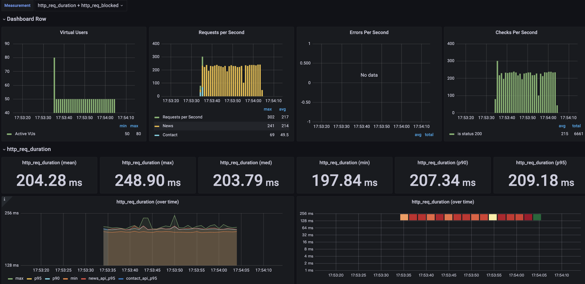

# `k6_performance_test_demo`

> This is a performance testing model with k6, and grafana.

### `Architecture`

```
.
├── README.md
├── api
│   ├── k6
│   │   └── api.js
│   └── pytest
│       └── api.js
├── requirement.txt
├── scenarios
│   ├── base_scenario.js
│   ├── k6
│   │   └── k6_scenario.js
│   └── pytest
│       └── pytest_scenario.js
└── tests
    ├── k6
    │   └── test.js
    └── pytest
        └── test.js
```

### `Demo`

```
k6 run --out influxdb=http://localhost:8086/K6_DB tests/k6/test.js

          /\      |‾‾| /‾‾/   /‾‾/   
     /\  /  \     |  |/  /   /  /    
    /  \/    \    |     (   /   ‾‾\  
   /          \   |  |\  \ |  (‾)  | 
  / __________ \  |__| \__\ \_____/ .io

  execution: local
     script: tests/k6/test.js
     output: InfluxDBv1 (http://localhost:8086)

  scenarios: (100.00%) 2 scenarios, 80 max VUs, 1m0s max duration (incl. graceful stop):
           * contacts: 100 iterations shared among 30 VUs (maxDuration: 30s, exec: contacts, gracefulStop: 30s)
           * news: 50 looping VUs for 30s (exec: news, gracefulStop: 30s)

running (0m30.2s), 00/80 VUs, 7218 complete and 0 interrupted iterations
contacts ✓ [=====================================] 30 VUs  01.4s/30s  100/100 shared iters
news     ✓ [=====================================] 50 VUs  30s       

     ✓ is status 200

     checks.........................: 100.00% ✓ 7218       ✗ 0   
     data_received..................: 12 MB   385 kB/s
     data_sent......................: 1.2 MB  39 kB/s
     http_req_blocked...............: avg=9.81ms   min=0s       med=3µs      max=625.56ms p(90)=6µs      p(95)=8µs     
     http_req_connecting............: avg=3.71ms   min=0s       med=0s       max=211.86ms p(90)=0s       p(95)=0s      
     http_req_duration..............: avg=204.02ms min=198.01ms med=203.54ms max=256.88ms p(90)=206.7ms  p(95)=208.92ms
       { expected_response:true }...: avg=204.02ms min=198.01ms med=203.54ms max=256.88ms p(90)=206.7ms  p(95)=208.92ms
     http_req_failed................: 0.00%   ✓ 0          ✗ 7218
     http_req_receiving.............: avg=80.76µs  min=7µs      med=49µs     max=8.47ms   p(90)=119µs    p(95)=163µs   
     http_req_sending...............: avg=30.65µs  min=3µs      med=20µs     max=6.38ms   p(90)=44µs     p(95)=55µs    
     http_req_tls_handshaking.......: avg=5.77ms   min=0s       med=0s       max=395.12ms p(90)=0s       p(95)=0s      
     http_req_waiting...............: avg=203.91ms min=197.92ms med=203.45ms max=256.68ms p(90)=206.59ms p(95)=208.77ms
     http_reqs......................: 7218    238.985343/s
     iteration_duration.............: avg=214.05ms min=198.23ms med=203.78ms max=854.86ms p(90)=207.04ms p(95)=210.6ms 
     iterations.....................: 7218    238.985343/s
     vus............................: 50      min=50       max=80
     vus_max........................: 80      min=80       max=80    
```




### `Requirement`

* *k6*
* *influxdb*
* *grafana*

### `Installation for macOS`

```
for k6
> brew install k6

for influxdb
> brew install influxdb@1

for grafana
> brew install grafana
```

### `Usage`

```
for influxdb
> brew services start influxdb@1
and folder forward to /opt/homebrew/opt/influxdb@1/bin and create database used influx

for grafana
> brew services start grafana
and browser go to http://localhost:3000/
and import dashboard https://grafana.com/grafana/dashboards/2587-k6-load-testing-results/

for k6
> k6 run --out influxdb=http://localhost:8086/my_k6_db test.js
```
